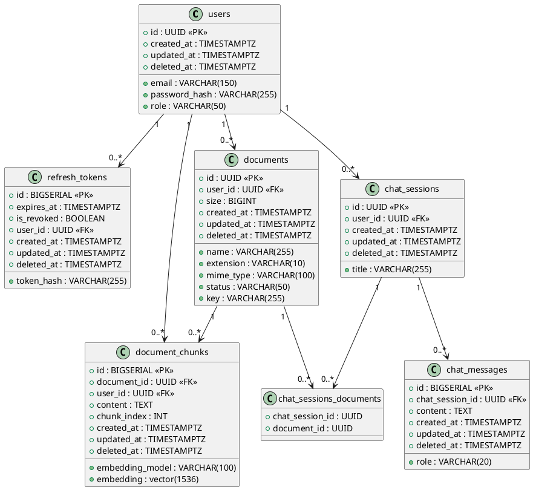

# 📚 DocChat — RAG-powered Document Q&A

A system that lets you upload documents, index them intelligently, and chat with an AI that answers exclusively using your own files.

---

## ✨ Features

- 📤 **Upload & process documents** — PDF, DOCX, TXT and more
- 💬 **AI-powered chat** — Ask questions and get answers grounded in your documents
- 🔎 **Intelligent search** — Semantic retrieval with hierarchical chunking
- 🕒 **Chat history** — Resume previous conversations at any time
- 🔒 **Private by design** — Each user only accesses their own files and chats

---

## 🗂️ Functional Requirements

### 👤 User Management
- Register and log in
- Private, isolated workspace per user
- Secure logout

### 📤 File Upload & Processing
- Upload files (PDF, DOCX, TXT, etc.)
- Automatic pipeline on upload:
  - Text extraction
  - Hierarchical chunking
  - Embedding generation and indexing
- Processing status: `processing` / `ready` / `error`

### 📚 Knowledge Base
- View and manage uploaded documents
- Delete documents
- Select which documents to use per chat session

### 💬 AI Chat
- Start new conversations
- Ask questions about selected documents
- Context-aware responses using only your content
- Multi-turn conversation support
- Multiple simultaneous chats

### 🔎 Semantic Search
- Finds relevant fragments across documents
- Automatic chunk selection
- Uses retrieved context to generate accurate answers

### 🕒 Chat History
- Browse previous conversations
- Continue past chats
- Delete chats

### 🔔 Feedback & Error Handling
- Typing/thinking indicator
- Graceful error messages (e.g. unprocessed file)
- Notifies when no relevant info is found in documents

### 🛡️ Security & Privacy
- Strict per-user data isolation
- No data cross-contamination between users
- Permanent data deletion support

---

## 🏗️ Architecture & Technical Details

### Storage
- Files are stored in **AWS S3**
- The backend generates a **presigned S3 URL** and delivers it to the client for direct upload

### Text Extraction
- **LlamaParse** is used to extract text from uploaded files

### Chunking Strategy
- **Hierarchical chunking** is applied to segment documents for optimal retrieval

### Embeddings
- **OpenAI Embeddings API** generates vector representations (`text-embedding-3-small`, 1536 dimensions)
- Vectors are stored in **PostgreSQL** using the `pgvector` extension

### Query Processing
- **Query Rewriting** reformulates user questions before retrieval to improve semantic search results

### Authentication
- **Access tokens** and **refresh tokens** with **token rotation**
- Secure, stateless session management

### Database
- **PostgreSQL** with `pgvector` for vector similarity search

---

## 🔌 Endpoints

### Authentication
* `POST /api/auth/register` - User registration
* `POST /api/auth/login` - Obtain Access and Refresh Tokens
* `POST /api/auth/refresh` - Token rotation
* `POST /api/auth/logout` - Revoke Refresh Token

### Chat
* `POST /api/chats` - Create a new chat session
* `POST /api/chats/:id` - Continue an existing chat session

### Documents
* `POST /api/upload` - Upload a new document
* `POST /api/documents/:id/confirm` - Confirm document upload

---

## 🗄️ Database Schema

```
users
  └── documents
        └── document_chunks (embeddings)
        └── chat_sessions_documents (join table)
  └── refresh_tokens
  └── chat_sessions
        └── chat_messages
        └── chat_sessions_documents (join table)
```

### Entity Relationship Diagram



> You can render this diagram at [PlantUML Online](https://www.plantuml.com/plantuml/uml/) or with any PlantUML-compatible tool.

---

## 🔄 RAG Pipeline Overview

```
User question
     │
     ▼
Query Rewriting          ← Reformulates the question for better retrieval
     │
     ▼
Embedding Generation     ← OpenAI Embeddings API
     │
     ▼
Vector Similarity Search ← pgvector (cosine similarity)
     │
     ▼
Chunk Retrieval          ← Hierarchical chunks from user's selected documents
     │
     ▼
LLM Prompt Construction  ← Injected context + conversation history
     │
     ▼
LLM Response             ← Grounded exclusively in the retrieved content
```

---

## 🛠️ Tech Stack

| Layer | Technology |
|---|---|
| File Storage | AWS S3 (presigned URLs) |
| Text Extraction | LlamaParse |
| Embeddings | OpenAI API (`text-embedding-3-small`) |
| Vector DB | PostgreSQL + pgvector |
| Auth | JWT (access + refresh tokens with rotation) |
| Chunking | Hierarchical Chunking |
| Query Enhancement | Query Rewriting |

---

## 🚀 Getting Started

> _(Add your setup instructions here: environment variables, database migrations, running the backend and frontend, etc.)_

```bash
# Example
cp .env.example .env

PORT=3000
NODE_ENV=development

# Configuración de la Base de Datos
DB_HOST=localhost
DB_PORT=5432
POSTGRES_USER=myuser
POSTGRES_PASSWORD=mypassword
POSTGRES_DB=mydb

# Configuración de JWT
JWT_SECRET=
JWT_EXPIRES_IN=1h

# Configuración de AWS
AWS_REGION=
AWS_BUCKET=
AWS_ACCESS_KEY=
AWS_SECRET_KEY=

# Configuración de la API de OpenAI
OPENAI_API_KEY=

# Configuración de la API de LlamaCloud
LLAMA_CLOUD_API_KEY=

# Run migrations
# Start the server
```
